[](https://github.com/Bosaj/semantic-web-knowledge-ontologies/actions)
[](https://github.com/Bosaj/semantic-web-knowledge-ontologies/attestations)
[](https://github.com/Bosaj?tab=packages)
[](https://github.com/users/Bosaj/projects/36)
[](LICENSE)

<div align="center">

<!-- Header Banner -->


<!-- Typing Animation -->
<p align="center">
  
</p>

<!-- Quality & Community Badges -->
<p align="center">
  <a href="LICENSE"></a>
  <a href="https://github.com/Bosaj/semantic-web-knowledge-ontologies/actions"></a>
  <a href="https://github.com/Bosaj/semantic-web-knowledge-ontologies"></a>
  <a href="https://github.com/users/Bosaj/projects"></a>
  <a href="https://github.com/stars/Bosaj/lists/eniad-academic-projects"></a>
  
</p>

</div>

<!-- Divider -->


## 📖 Overview

**ENIAD Semantic Web & Knowledge Ontologies** is an official engineering laboratory suite developed within the **State Engineering Degree in Artificial Intelligence & Digital Systems** at the **École Nationale d'Intelligence Artificielle et du Digital (ENIAD)**, Mohammed First University, Berkane, Morocco.

Knowledge Engineering and Semantic Web Architecture with Protégé, OWL 2, RDF Schema, SWRL Rules, Pellet/HermiT Reasoners, and SPARQL Query Processing.

---

## 🏗️ Technical Architecture

```mermaid
graph LR
    A[Domain Knowledge & Competency Questions] --> B[Taxonomy & Concept Hierarchy]
    B --> C[Protégé Ontology Modeling]
    C --> D[OWL 2 / RDF Schema]
    D --> E[SWRL Semantic Rules]
    E --> F[HermiT / Pellet DL Reasoner]
    F --> G[Inferred Knowledge Base]
    G --> H[SPARQL Query Endpoint]
    style A fill:#00D9FF,stroke:#333,stroke-width:1px,color:#000
    style C fill:#FF6B00,stroke:#333,stroke-width:1px,color:#fff
    style F fill:#3C873A,stroke:#333,stroke-width:1px,color:#fff
    style H fill:#7928CA,stroke:#333,stroke-width:1px,color:#fff

```



---

## 📂 Curriculum & Laboratory Breakdown

| Module / Lab | Topic | Deliverables & Artifacts |
|---|---|---|
| `Partie 1: Théorie` | Knowledge Representation | Stanford 101 ontology lifecycle, conceptualization, competency definitions |
| `Partie 2: Protégé` | Taxonomy & Classes | Hierarchy authoring, object and data properties, domain & range constraints |
| `Partie 3: Formalismes` | OWL 2 & Description Logics | Axiomatic constraints, disjointness, universal and existential quantifiers |
| `Partie 4: Raisonnement` | DL Reasoners & SWRL | Automated subsumption, consistency verification using HermiT and Pellet |
| `Partie 5: SPARQL` | Semantic Queries | SELECT, CONSTRUCT, ASK queries, federated queries, knowledge extraction |
| `Library Ontology` | Complete Deliverable | `tp1_library.owl`, `tp1_library_cleaned.owl`, `TP1_Library_Report.pdf` |


---

## 📚 Technical Wiki & Documentation

Comprehensive architectural explanations, step-by-step lab walk-throughs, and methodology guides are available:
- **In-Repository Wiki Mirror**: [`docs/wiki/Home.md`](docs/wiki/Home.md)
- **Architecture Overview**: [`docs/ARCHITECTURE.md`](docs/ARCHITECTURE.md)
- **Curriculum Matrix**: [`docs/CURRICULUM_MATRIX.md`](docs/CURRICULUM_MATRIX.md)
- **GitHub Wiki**: [https://github.com/Bosaj/semantic-web-knowledge-ontologies/wiki](https://github.com/Bosaj/semantic-web-knowledge-ontologies/wiki)

---

## 🚀 Getting Started

### Prerequisites
- Git installed on your local workstation
- Development runtime corresponding to the target laboratory (Python 3.10+, Java JDK 17+, Android Studio, or C++ compiler)

### Installation & Cloning
```bash
git clone https://github.com/Bosaj/semantic-web-knowledge-ontologies.git
cd semantic-web-knowledge-ontologies
```

---

## 📜 DevSecOps Governance & Standards

This repository adheres to strict open-source engineering and academic integrity standards:
- [LICENSE](LICENSE): Open-source MIT License.
- [CONTRIBUTING.md](CONTRIBUTING.md): Guidelines for submitting contributions, issue templates, and code formatting.
- [CODE_OF_CONDUCT.md](CODE_OF_CONDUCT.md): Contributor Covenant v2.1 code of conduct.
- [SECURITY.md](SECURITY.md): Responsible vulnerability reporting procedures.
- [CHANGELOG.md](CHANGELOG.md): Version history following Keep a Changelog standards.
- [CITATION.cff](CITATION.cff): Machine-readable academic citation metadata.

---

## 👤 Author & Academic Credits

- **Engineer / Researcher**: **Oussama EL HADJI** ([@Bosaj](https://github.com/Bosaj))
- **Role**: AI & Automation Engineer @ Circet Morocco | ENIAD Engineering Graduate
- **Institution**: École Nationale d'Intelligence Artificielle et du Digital (ENIAD), Berkane, Morocco
- **Portfolio**: [bosaj.vercel.app](https://bosaj.vercel.app) • [LinkedIn](https://www.linkedin.com/in/oussama-elhadji)

---

<div align="center">
  <sub>Maintained with ❤️ by <a href="https://github.com/Bosaj">Oussama EL HADJI</a> • ENIAD Berkane</sub>
</div>
